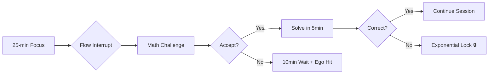

# 🧠 FlowState Enforcer - *The Villain Arc Productivity System*

> **"The system that fights your procrastination with your own ego."**

A brutally effective, open-source productivity tool that interrupts your flow state to force consistent skill development.
Built by someone who hated math so much, he coded his own disciplinary AI overlord.


---

## ⚡ Problem Statement

Ever been so deep in coding that you forget to eat, sleep, or study what actually matters?

Most productivity tools act like gentle reminders. This one?
It’s a **digital drill sergeant** that leverages **psychological pressure, adaptive challenges, and ego-punishment** to turn weaknesses into strengths.

---

## 🎯 The Three-Warhead Solution

1. **🎓 Exam Prep Autopilot** → forces consistent practice via unavoidable interruptions
2. **⚡ Flow State Management** → timed breaks without losing focus momentum
3. **🔥 Ego-Based Motivation** → roasts, shame, and punishment keep you honest

---

## 🏗️ System Architecture

### Core Layers

| Layer                 | Purpose                  | Tech Stack            |
| --------------------- | ------------------------ | --------------------- |
| **Flow Interrupt**    | Timed session locking    | Python, Bash, systemd |
| **Challenge Engine**  | Adaptive Q&A generation  | Local LLM, JSON       |
| **Punishment System** | Exponential lock timers  | Python, GUI           |
| **Ego Roast Module**  | Psychological motivation | Roast packs (JSON)    |

### The Brutal Workflow



---

## 🚀 Installation

>     Linux only. If you still want to click “Next” on installation wizards, go back to your toys.
>     The grown-ups are working here — don’t disturb.

```bash
# Clone the repository
git clone https://github.com/yourusername/flowstate-enforcer.git
cd flowstate-enforcer

# Run the setup script (Debian/Ubuntu)
chmod +x setup.sh
./setup.sh

# Configure your weak topics
python3 config.py --topics algebra calculus statistics
```

---

## 🎮 Usage

```bash
# Start the enforcer (daemon mode)
python3 flow_enforcer.py --start

# Check status
python3 flow_enforcer.py --status

# Stop the pain (this is fake script, it doesnt exist, either solve math or sacrifice dignity to make it stop haunting your dreams)
python3 flow_enforcer.py --stop
```

---

## 🔥 Features That Hurt So Good

* **The "Be a Good Boy" Button** → surrender mode, forces 10-min wait with insults
* **Exponential Punishment** → wrong answers scale up lock time exponentially
* **Adaptive Difficulty** → system learns what you suck at, keeps hitting that spot
* **Roast Packs** → JSON-based, fully customizable community roasts
* **Local LLM Integration** → offline, no cloud spying, no paywalls

---

## 🧩 Technical Stack

* **Language**: Python 3.8+, Bash scripting
* **Scheduling**: Cron, systemd timers
* **GUI (optional)**: PyQt5 (lockscreen)
* **AI**: Local LLM (Ollama, GPT4All, or custom backend)
* **Platform**: Linux (Debian/Ubuntu/Arch tested)

---

## 📂 File & Folder Structure

Here’s how the repo is organized (clean, modular, and contributor-friendly):

```
.
├── CHANGELOG.md              # version history
├── CONTRIBUTING.md           # how to contribute (PRs, roast packs, etc.)
├── LICENSE                   # MIT License
├── README.md                 # this file
├── config.example.json       # sample config file
├── config.py                 # CLI for generating configs
├── flow_enforcer.py          # main daemon entrypoint
├── setup.sh                  # auto installer + systemd setup
│
├── core/                     # core logic (modularized)
│   ├── challenges.py         # challenge generator (math, etc.)
│   ├── punishment.py         # exponential lock system
│   ├── roaster.py            # roast pack handler
│   └── flow.py               # session/flow manager
│
├── system/                   # Linux integration
│   ├── flow-enforcer.service # systemd unit file
│   └── flow-enforcer.timer   # systemd timer file
    ├── villain-arc-optin.desktop    # autostart entry (starts opt-in GUI)
    ├── optin_dialog.py              # boot interrogation GUI
    └── ollama_manager.py            # LLM lifecycle handler
│
├── data/                     # static resources
│   ├── roasts.json           # default roast pack
│   └── questions.json        # sample challenges
│
├── demo/                     # screenshots, gifs, demos
│   └── demo.gif
│
└── tests/                    # pytest-based unit tests
    ├── test_challenges.py
    ├── test_punishment.py
    └── test_roaster.py
```

👉 **Why this structure?**

* **Separation of concerns**: logic (`core/`), resources (`data/`), OS stuff (`system/`)
* **Contributor-friendly**: roast packs & challenges live in JSON → easy to add without coding
* **Professional**: tests, changelog, and contributing guidelines make it feel legit

---

## 🎯 Roadmap

* [ ] **v1.0**: Core flow interrupt + roast packs
* [ ] **v1.1**: Local LLM challenge generation
* [ ] **v1.2**: Subject support beyond math
* [ ] **v2.0**: Cross-platform support (maybe)
* [ ] **v3.0**: Roast & challenge community sharing

---

## 🤝 Contributing

We welcome fellow productivity masochists:

* Add more roast packs
* Improve challenge generation
* Extend to new subjects
* Design better lockscreen interfaces

See [CONTRIBUTING.md](CONTRIBUTING.md) for how to contribute.

---

## 📜 License

MIT License → freedom + pain = productivity.

---

## 💡 Backstory

> *Started coding at 9. By 16, had 7 years of experience but still hated math. With A-levels looming, I coded my way out of procrastination. This system is that unhinged yet effective solution.*